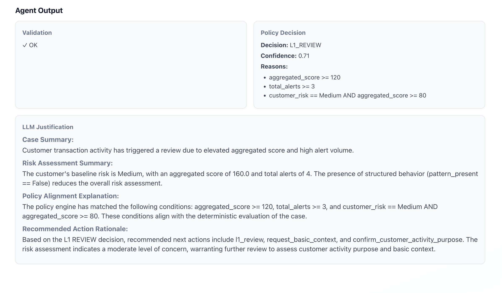

# AML Investigation Agent

An agentic pipeline that automates AML case investigation: it computes risk and behavior signals, runs a policy engine, then generates an LLM-backed justification for the decision. Built with LangGraph, FastAPI, and React.

---


---

---

## What problem does this solve?

**Investigative automation for AML (anti–money laundering).**

- **Massive alert queues** — Teams drown in transaction-monitoring alerts and pending tasks.
- **Rising regulatory pressure** — Regulators expect consistent, documented decisions.
- **Expensive manual work** — Each case is reviewed by hand; slow and inconsistent.

This project turns a single “enriched case” (alerts + transactions + customer snapshot) into a **decision** (e.g. CLOSE_NO_ACTION, L1_REVIEW, ESCALATE_L2, SAR_REVIEW_L2) plus a **short, audit-ready justification** — so investigators get a consistent first pass and auditors get clear reasoning.

---

## Who is it for?

- **OCC-regulated banks** — Transaction monitoring and alert triage.
- **Payroll / fintech platforms** — Compliance and SAR workflows.
- **Global exchanges** — Alert backlogs, investigator workload, policy consistency, regulatory reporting.

---

## How we tackle it

1. **Risk + behavior signals** — Derived from the enriched case (amounts, velocity, crypto %, patterns, etc.).
2. **Deterministic policy engine** — Rule-based evaluation on those signals → decision + reasons + debug signals.
3. **LLM justification** — A local LLM (e.g. via LM Studio) writes a short, structured narrative from the policy output only (no extra data), so the narrative stays aligned with the decision.
4. **Validation** — Check that the justification is present and valid; optional guardrails (e.g. must reference policy reasons).

So: **signals → policy decision → narrative → validate**. The “intelligence” is in the policy rules and the structured prompt; the LLM only explains, it doesn’t decide.

---

## Data used

- **Enriched cases** — `Generate_Data/enriched_cases/enriched_cases.jsonl`. Each line is one case: `case_id`, `customer_id`, `customer_snapshot`, `case_metadata`, `alerts_in_case`, `flagged_transactions`, `behavior_snapshot`. The UI and API load cases from here (and optionally attach customer names from `Generate_Data/customer_engine/customer_profiles.jsonl`).
- **Policy** — `policies/policy_v1.json` (and optional `policy_v1.md`). Defines decision tiers, thresholds, and rule blocks the policy engine evaluates.
- **LLM** — No extra data. The LLM only sees the policy engine output (decision, reasons, debug_signals) and a fixed system prompt so it can’t invent new facts.

---

## Architecture (high level)

```
[Frontend]  →  [FastAPI]  →  [LangGraph]
   React          API           pipeline
                    ↓
            enriched_case
                    ↓
   tool1_risk → tool2_behavior → policy_engine → llm_justify → validate
        ↓              ↓               ↓              ↓            ↓
   risk_signals  behavior_signals  policy_decision  llm_justification  validation_ok
```

- **Frontend (React + Vite):** Case dropdown (by customer name), “Run Agent”, streaming progress, then result (validation, decision, reasons, LLM justification).
- **API (FastAPI):** `GET /api/cases` (list cases, one per customer), `POST /api/run` (run agent, return final state), `POST /api/run-stream` (same run but SSE progress events).
- **Graph (LangGraph):** Single linear graph. One shared state (TypedDict); each node reads from state and writes back a delta (e.g. `risk_signals`, then `behavior_signals`, then `policy_decision`, then `llm_justification`, then `validation_ok` / `validation_errors`).

---

## How LangGraph is used

- **State:** One `AgentState` TypedDict: `enriched_case`, `risk_signals`, `behavior_signals`, `policy_decision`, `llm_justification`, `llm_justification_meta`, `validation_ok`, `validation_errors`.
- **Nodes:**  
  - `tool1_risk` — calls risk-signals logic on `enriched_case`, returns `risk_signals` (or validation error).  
  - `tool2_behavior` — calls behavior-signals logic on `enriched_case`, returns `behavior_signals`.  
  - `policy_engine` — runs `PolicyEngine.evaluate_enriched_case(enriched_case)` (which uses risk + behavior internally), returns `policy_decision`.  
  - `llm_justify` — builds a prompt from `policy_decision` + system prompt, calls LM Studio, parses JSON, validates keys and guardrails, returns `llm_justification` (+ meta).  
  - `validate` — checks `policy_decision` and `llm_justification` (e.g. present and non-empty), returns `validation_ok` and `validation_errors`.
- **Edges:** Linear: tool1 → tool2 → policy_engine → llm_justify → validate → END. No branching; state is passed along and merged after each node.
- **Streaming:** For the UI, the API uses `graph.stream(state, stream_mode="values")` and sends SSE progress events (one per node) so the frontend can show “Calculating risk…”, “Running policy…”, etc., then the final result.

So LangGraph is used as a **fixed, linear pipeline** with shared state and clear node boundaries — no cycles or conditional edges.

---

## Important implementation details

- **Policy engine** — Loads JSON policy, runs rule blocks (thresholds, severity), merges risk/behavior with case data, applies conflict resolution, outputs decision + reasons + debug_signals. All logic is in `agent/policy_engine/`.
- **LLM node** — Only gets a slice of `policy_decision` (decision, confidence, reasons, required_next_actions, debug_signals). Output is validated JSON with required keys (e.g. case_summary, risk_assessment_summary, policy_alignment_explanation, recommended_action_rationale). Optional guardrail: justification should reference at least one of the policy reasons.
- **Customer names in UI** — API loads `customer_profiles.jsonl`, builds `customer_id → "first_name last_name"`, attaches `customer_name` to each case in `/api/cases`. Dropdown shows one case per customer (deduplicated by `customer_id`).

---

## Tech stack

- **Backend:** Python 3, FastAPI, LangGraph, OpenAI-compatible client (for LM Studio).
- **Policy + tools:** Pure Python (no LLM in policy); `agent/tools/` for risk and behavior signals; `agent/policy_engine/` for rule evaluation.
- **Frontend:** React 18, TypeScript, Vite.

---

## Setup and run

**1. Backend**

- From repo root:
  - `python -m venv .venv` (or use existing venv).
  - Activate: `source .venv/bin/activate` (or `.venv\Scripts\activate` on Windows).
  - Install: `pip install fastapi uvicorn pydantic json-repair langgraph langchain openai`.
- Optional: run LM Studio locally, load a model (e.g. Llama 3.2 3B), start server (e.g. port 1234). If you skip this, the graph still runs but the LLM node will fail and return `llm_justification: null` with an error in meta.
- Run API: `PYTHONPATH=. python api/main.py` (or `uvicorn api.main:app --reload` with `PYTHONPATH=.`). API listens on port 8000.

**2. Frontend**

- `cd frontend`
- `npm install`
- `npm run dev`. Dev server runs on port 5173; set `API_BASE` in the app if your API is elsewhere.

**3. Data**

- Ensure `Generate_Data/enriched_cases/enriched_cases.jsonl` exists (one JSON object per line per case).
- Ensure `policies/policy_v1.json` exists.
- Optional: `Generate_Data/customer_engine/customer_profiles.jsonl` for customer names in the dropdown.

**4. Use**

- Open the frontend (e.g. http://localhost:5173), pick a customer/case, click “Run Agent”. Progress streams step-by-step; then you see validation, policy decision, and LLM justification (or an error if the LLM call or validation failed).

---

## Project layout (main pieces)

- `api/main.py` — FastAPI app, `/api/cases`, `/api/run`, `/api/run-stream`.
- `agent/graph/build_graph.py` — LangGraph definition (nodes + edges).
- `agent/graph/state.py` — `AgentState` TypedDict.
- `agent/graph/node.py` — tool1, tool2, policy_engine wrapper, validate node.
- `agent/graph/node_llm_justification.py` — LLM call, JSON parse, validation, guardrails.
- `agent/policy_engine/` — Policy loading and rule evaluation.
- `agent/tools/` — Risk and behavior signal extraction.
- `config/prompts.py` — System prompt for the LLM.
- `frontend/src/App.tsx` — UI (case select, run, progress, results).
- `policies/policy_v1.json` — Policy spec.
- `Generate_Data/` — Enriched cases, customer profiles, and any upstream data generation.

---

## License / status

Code as-is for experimentation and demos. Not production-hardened (e.g. auth, rate limits, full error handling). Tune policy and prompts for your own rules and compliance needs.
